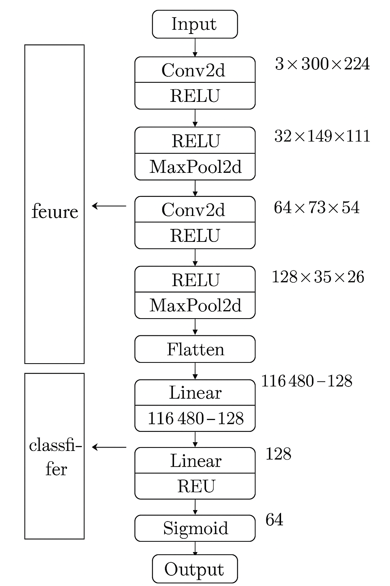

# 🐶 Dog vs 🐱 Cat Classifier

[DEMO](https://dog-vs-cat.streamlit.app/)

A deep learning project that classifies images as either **Dog** or **Cat** using a Convolutional Neural Network (CNN) built with PyTorch. Includes a simple Streamlit app for real-time inference.

---

## 📊 Model Summary

- **Architecture**: Custom CNN with 3 convolutional layers followed by fully connected layers.
- **Framework**: PyTorch
- **Dataset**: [Dogs vs Cats dataset](https://www.kaggle.com/datasets/salader/dogs-vs-cats)
- **Label Mapping**: `{'cats': 0, 'dogs': 1}`
- **Final Accuracy**: **~99%** on training data after 10 epochs.

Architecture:



<code> Generated by ChatGPT </code>

### CNN Layers


---

## 🧪 Training Results

### Before 

| Epoch | Loss     | Accuracy |
|-------|----------|----------|
| 1     | 0.6010   | 65.6%    |
| 5     | 0.0714   | 97.5%    |
| 10    | 0.0283   | **99.0%**|

### After Data Augmentation & Dropout layer

| Epoch | Loss     | Accuracy |
|-------|----------|----------|
| 1     | 0.64040   | 61.6%    |
| 5     | 0.4582  | 78.5%    |
| 10    | 0.4037  | **82.3%**|


## 🧪 Training Results

### Before

```
Average Validation Loss: 1.1613 | Average Accuracy: 0.7830
```

### After Data Augmentation & Dropout layer

```
Average Validation Loss: 0.4150 | Average Accuracy: 0.8190
```

---
